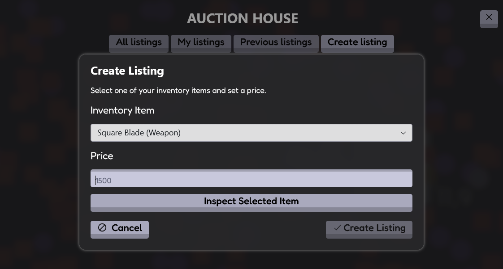
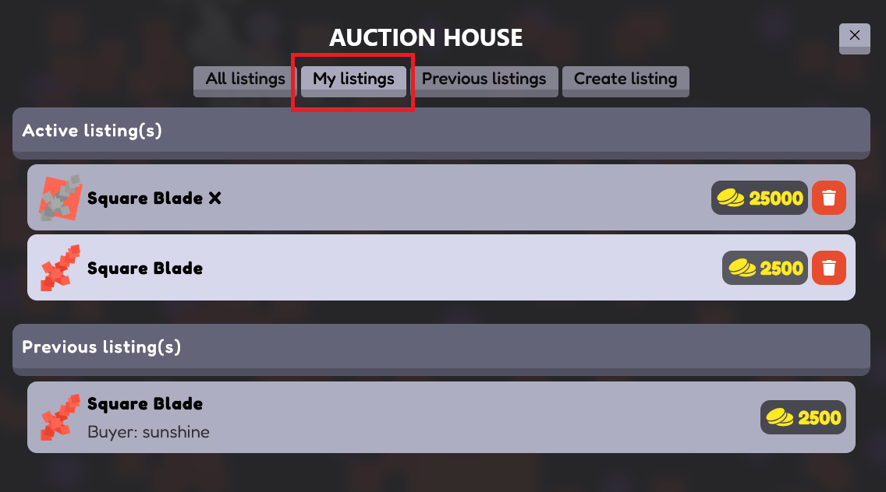
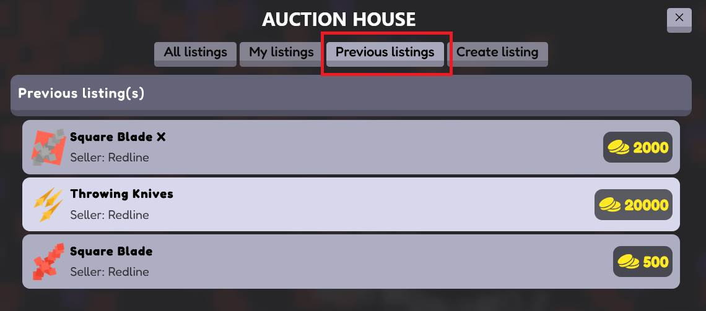

# Squirkle – Felhasználói kézikönyv

---

## Bevezetés

A Squirkle egy böngészőben futó játék, amely egy Unity WebGL alapú játékmotort integrál egy modern webes felülettel.

A játék során a felhasználó:
- ellenségeket győz le
- tárgyakat és érméket gyűjt
- új területeket old fel
- tárgyakat kereskedik az aukciós rendszerben

A felhasználói felület célja, hogy egyszerűen és intuitívan biztosítsa a játék funkcióinak elérését.

---

## Főoldal

Az alkalmazás megnyitásakor a felhasználó a főoldalra érkezik.

A főoldalon található „Play” gomb (pirossal jelölve) a játék elindítására szolgál.

### Működés

- Amennyiben a felhasználó **nincs bejelentkezve**, a gombra kattintva a rendszer a **bejelentkezési felületre** irányítja.
- Amennyiben a felhasználó **be van jelentkezve**, a gomb megnyomása után közvetlenül a **játék felületére** kerül.

A folyamat automatikusan történik, a felhasználó külön beavatkozása nélkül.

### Cél

A főoldal célja:
- a felhasználó gyors beléptetése a rendszerbe
- a játék elindításának egyszerűsítése

---

## Bejelentkezés

A főoldalról a felhasználó a bejelentkezési felületre kerül.

Két módon lehet bejelentkezni:
- email és jelszó megadásával
- Google fiókkal

A Google bejelentkezés gomb (pirossal jelölve) lehetővé teszi a gyors belépést.

---

### Felhasználónév megadása

Amennyiben a felhasználó még nem rendelkezik felhasználónévvel, a rendszer egy párbeszédablakot jelenít meg.

Itt egy egyedi felhasználónév megadása szükséges.

---

### Hibakezelés

Ha a megadott felhasználónév már foglalt, vagy hiba történik, a rendszer hibaüzenetet jelenít meg.

---

### Sikeres bejelentkezés

Sikeres bejelentkezés és felhasználónév megadás után a rendszer értesítést jelenít meg, majd automatikusan a játék felületére navigál.

---

## Regisztráció

Amennyiben a felhasználó nem rendelkezik fiókkal, lehetősége van regisztrációra.

A regisztrációs felület a bejelentkezési oldalról érhető el a „Registration” gomb (pirossal jelölve) segítségével.

### Adatok megadása

A felhasználónak az alábbi adatokat kell megadnia:

- felhasználónév
- email cím
- jelszó
- jelszó megerősítése

A jelszónak legalább nyolc (8) karakter hosszúnak kell lennie.

### Működés

A „Registration” gombra kattintva a rendszer ellenőrzi a megadott adatokat.

- Ha az adatok megfelelőek, a regisztráció sikeres
- Hiba esetén a rendszer visszajelzést ad

Sikeres regisztráció után a felhasználó bejelentkezhet, vagy közvetlenül folytathatja a játékot.

### Alternatív bejelentkezés

A felhasználó Google fiókkal is regisztrálhat és bejelentkezhet a „Login with Google” gomb segítségével.

---

## Játék felület

Bejelentkezés után a felhasználó a játék felületére kerül.

---

### Navigációs sáv (Navbar)

A navigációs sáv segítségével a játék fő funkciói érhetők el.

A felső sáv tartalmazza:
- területválasztó (Area)
- Inventory
- Aukciós ház (Auction House)
- aktuális coin (érme) mennyiség
- felhasználónév

---

#### Menü (jobb felső sarok)

A jobb felső sarokban található menü további lehetőségeket biztosít.

Általános funkciók:
- **Logout** – kijelentkezés a rendszerből

Admin jogosultság esetén:
- **Item management** – itemek kezelése
- **Metadata management** – item metaadatok kezelése

---

#### Mobil nézet

Mobil eszközön a navigációs sáv egyszerűsödik:

- a menüpontok egy hamburger menübe kerülnek
- a képernyő helyének optimalizálása érdekében

A menü megnyitásával érhetők el:
- Area
- Inventory
- Auction House
- Admin funkciók (ha elérhetők)
- Logout

A jobb oldalon látható a felhasználó aktuális coin mennyisége.

---

### Játékmenet

A játék során a felhasználó:

- egér mozgatásával (asztali gépen)
- vagy érintéssel (mobil eszközön)

irányítja a karaktert, és elpusztítja a különböző formákat.

Az ellenségek legyőzése után:
- érméket (coin)
- valamint tárgyakat (például fegyvereket és páncélokat)

szerezhet.

Ezek az elemek később az Inventory-ban kezelhetők vagy az Aukciós házban értékesíthetők.

---

### Pályaválasztás (Area selector)

A navigációs sáv segítségével új pályák választhatók.

A különböző pályák feloldásához a játék során gyűjtött érmék szükségesek.

- elegendő coin esetén a pálya megvásárolható
- ellenkező esetben a rendszer jelzi a hiányt

A megvásárolt pályák később bármikor újra kiválaszthatók.

---

## Inventory

Az Inventory-ban (leltárban) a játék során megszerzett tárgyak kezelhetők.

Alapértelmezés szerint üres, és a játék során töltődik fel.

---

### Tárgy kiválasztása

A felhasználó egy tárgyra kattintva megtekintheti annak részletes adatait.

A különböző állapotok vizuálisan eltérő módon jelennek meg:
- kék keret: listázott item
- jobb oldali panel: felszerelt item

---

### Tárgy részletek (Item Details)

A kiválasztott tárgy részletes adatai egy külön ablakban jelennek meg.

Itt látható:
- leírás
- statisztikák
- speciális képességek

---

### Felszerelés (Equip)

A felszerelt tárgyak az Inventory jobb oldalán jelennek meg.

A „Equip Item” gombbal a kiválasztott tárgy felszerelhető, és azonnal aktívvá válik a játék során.

A „Unequip Item” gombbal a tárgy eltávolítható.

---

### Eladásra listázott tárgyak

- az eladásra listázott tárgyak nem használhatók
- a használatban lévő tárgyak nem listázhatók

---

### Használat (Weapon activation)

A fegyverek használata platformtól függően történik:

- **Asztali gépen:**
  - bal egérgomb nyomva tartása körülbelül 1 másodpercig
  - aktiválás után mozgatható (a fegyver mozgatása megszakítja a feltöltést)

- **Mobil eszközön:**
  - dupla koppintással aktiválható

---

## Aukciós ház (Auction House)

Az aukciós ház lehetővé teszi a játékosok közötti tárgyak adásvételét.

### Navigáció

- All listings – összes aktív hirdetés
- My listings – saját hirdetések
- Previous listings – korábbi hirdetések
- Create listing – új hirdetés létrehozása

---

### Új hirdetés létrehozása

A felhasználó:
- kiválaszt egy inventory itemet
- megad egy árat
- létrehozza a hirdetést

Fontos:
- a használatban lévő tárgyak nem listázhatók

---

### Saját hirdetések

A felhasználó itt kezelheti saját hirdetéseit.

A hirdetések törölhetők a kuka ikon segítségével.

---

### Korábbi hirdetések

Itt láthatók a korábban eladott vagy lejárt hirdetések.

---

### Item management 

#### Új item létrehozása

Az admin új itemet hozhat létre a szükséges adatok megadásával. 

Megadható: 
- item típusa 
- név és leírás 
- metaadatok (ability-k) 
- statisztikák (sebzés, crit, knockback stb.) 
- kép feltöltése

A művelet a **Submit** gombbal véglegesíthető. 

#### Item módosítása 
 

A meglévő itemek adatai módosíthatók a Modify item fülön.

Lehetőség van: 
- adatok szerkesztésére 
- item törlésére (Delete gomb) 

Fontos:
- a módosítások a Submit gombbal menthetők

#### Item kiválasztása 

 

A módosításhoz először ki kell választani egy itemet.

Ez két módon történhet: 
- a lista böngészésével 
- kereséssel 

A kiválasztott item adatai a szerkesztő felületen jelennek meg.
A ceruza ikon segítségével tölthetők be az adott item adatai.
Ha nem megfelelő item lett kiválasztva, a **Select another item** gombbal új item választható. 

---
### Metadata management 

Az admin felületen lehetőség van új metadata elemek létrehozására, valamint meglévők módosítására.
A metadata elemek határozzák meg az itemek speciális tulajdonságait (pl. képességek, effektek).

#### Új metadata létrehozása 

Új metadata hozható létre a szükséges adatok megadásával.

Megadható: 
- metadata azonosító (ID) 
- cím (title) 
- leírás 
- szöveg színe 
- háttérszín

A beállítások azonnal megjelennek az előnézetben (Preview).

A művelet a **Submit** gombbal véglegesíthető.

#### Metadata módosítása 

A meglévő metadata elemek módosíthatók a Modify metadata fülön.

Lehetőség van: 
- szöveg és leírás szerkesztésére 
- színek módosítására 
- azonnali előnézet megtekintésére 
- metadata törlésére (Delete gomb) 

A módosítások a **Submit** gombbal menthetők. 

#### Metadata kiválasztása

A módosításhoz először ki kell választani egy metadata elemet. 

Ez történhet: 
- kereséssel 
- listából történő kiválasztással 

A ceruza ikon segítségével tölthetők be a kiválasztott metadata adatai. 
Ha másik metadata szükséges, a **Select another metadata** gombbal választható új elem.

---

## Összegzés

A Squirkle felhasználói felülete egyszerű és intuitív módon biztosítja a játék alapvető funkcióinak elérését.

A rendszer célja, hogy a játékos gyorsan és könnyen navigálhasson a különböző funkciók között, miközben a játékmenet zavartalan marad.