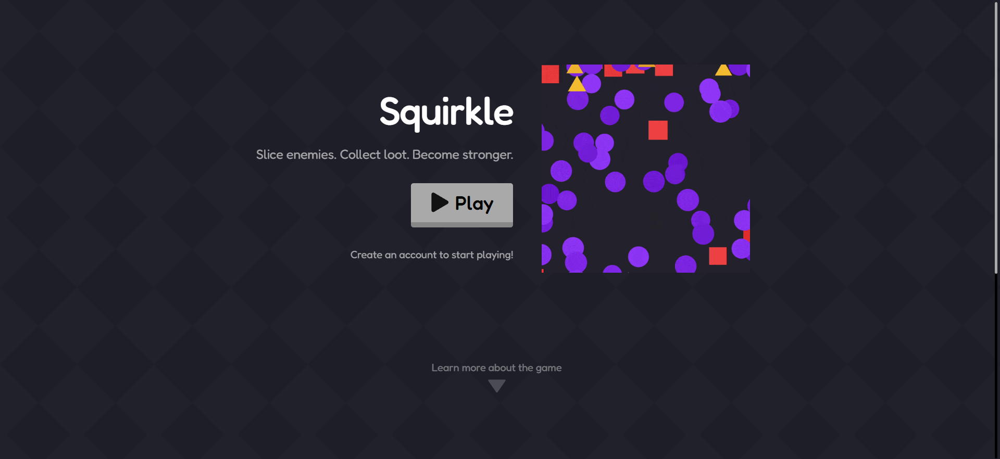
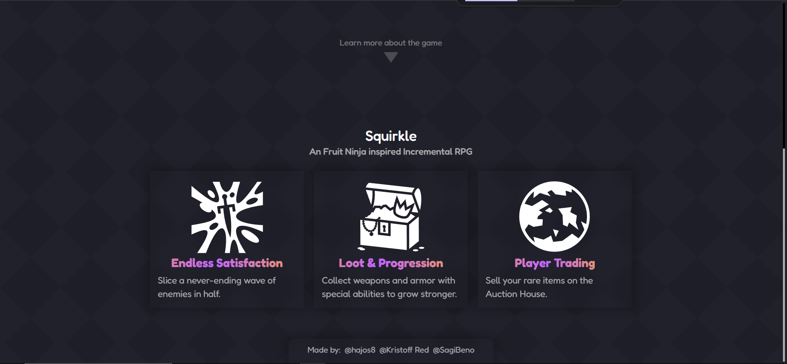
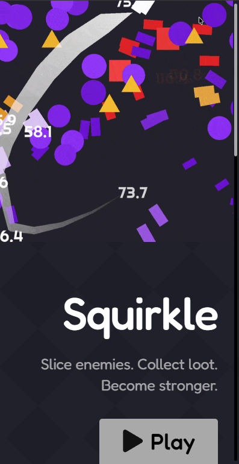
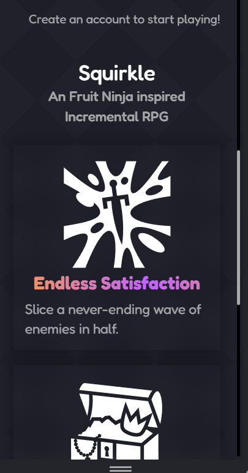
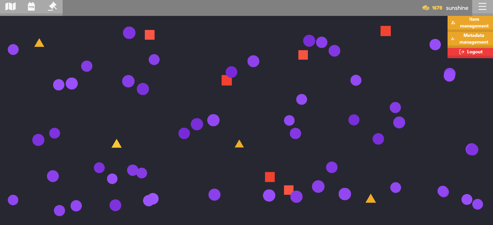
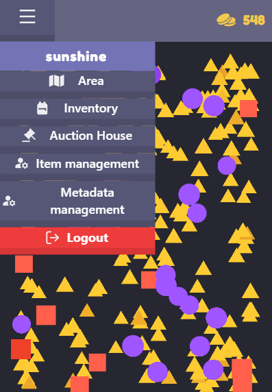
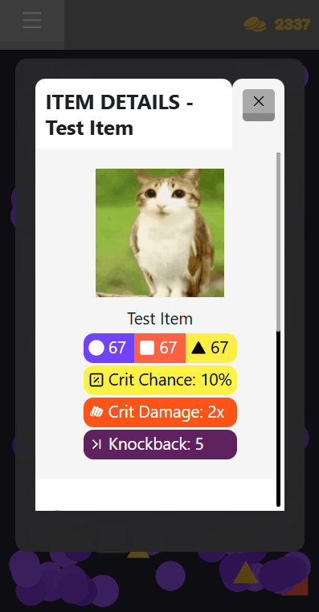
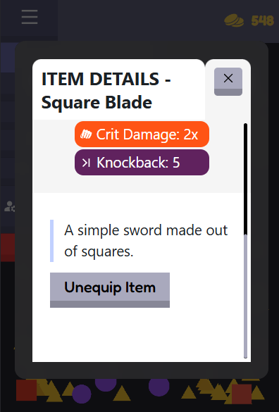
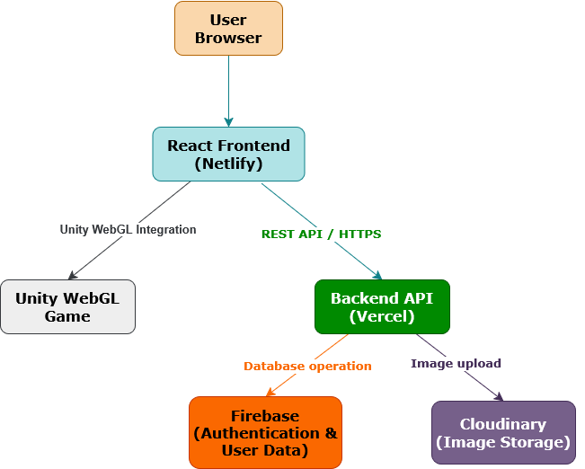
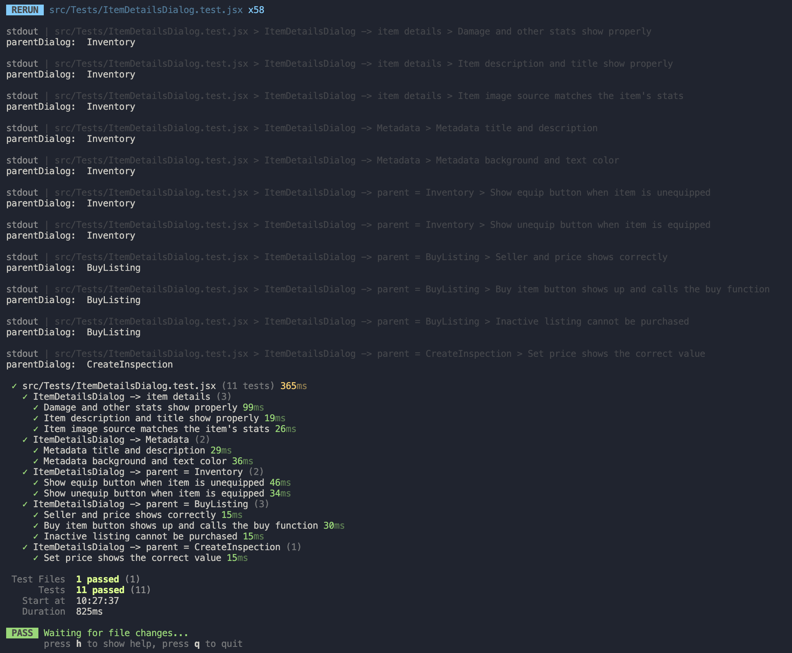

# Squirkle – Frontend Dokumentáció

---

## Az alkalmazás célja

A Squirkle egy böngészőben futó játékplatform, amely egy Unity WebGL játékot integrál egy webes felületbe.

A felhasználók:
- ellenségeket győznek le
- tárgyakat és érmét gyűjtenek
- új területeket oldanak fel
- tárgyakat kereskednek egy piactéren (auction house)

Az alkalmazás célja egy interaktív, játékos élmény biztosítása webes környezetben.

---

## Funkciók és működés

### Fő funkciók

- **Felhasználó kezelés (Authentication)**
  - Google alapú bejelentkezés
  - egyedi felhasználónév létrehozása

- **Játék (Unity WebGL)**
  - ellenségek folyamatos spawnolása
  - különböző formák (kör, négyzet, háromszög)
  - boss rendszer időszakosan

- **Inventory rendszer**
  - megszerzett tárgyak kezelése
  - equip / unequip funkciók

- **Auction House**
  - tárgyak listázása
  - vásárlás
  - törlés

- **Területek (Areas)**
  - érmék felhasználásával feloldhatóak

- **Admin felület**
  - item létrehozás
  - metadata kezelés

### Működés

A játék során:
1. Ellenségek jelennek meg
2. A játékos legyőzi őket
3. Drop: item vagy valuta
4. Inventory frissül
5. Itemek eladhatók az aukciós rendszerben

#### Játékmenet folyamata


---

## Reszponzivitás

Az alkalmazás reszponzív kialakítású, különböző eszközökön is megfelelően működik.

```
Főoldal megjelenése nagy kijelzőn
```



```
Főoldal megjelnése kis kijelzőn
```

|  |  |

```
Navigációs sáv megjelenése nagy kijelzőn
```


```
Navigációs sáv megjelenése kis kijelzőn
```



```
Tárgy részletező ablak nagy kijelzőn
```


```
Tárgy részletező ablak kis kijelzőn
```
|  |  |

### Desktop
- teljes layout
- külön navbar gombok
- szélesebb táblázatok

### Mobil
- hamburger menü (Dropdown)
- kisebb UI elemek
- ScrollArea használata
- vertikális elrendezés

### Tablet
- köztes layout

### Technikai megoldások
- breakpoint alapú megjelenítés (pl. max-width: 640px)
- magasság alapú optimalizálás (dialogoknál)
- Radix UI komponensek használata

---

## Rendszer architektúra

Az alábbi ábra bemutatja az alkalmazás fő komponenseit és azok kapcsolatát.



### Játék betöltése és automatikus frissítése
A Squirkle egy elég összetett rendszert használ a játék betöltésének kezelésére.

A játékfájlok Netlify-on vannak tárolva, amely egy ingyenes CDN-ként működik, elég nagy tárhely- és sávszélesség-korlátokkal. Néhány további fájl is tárolva van az automatikusan tömörített (zipelt) játékfájlok mellett.

A CORS korlátozás egy `_headers` fájlban van letiltva. Ez lehetővé teszi, hogy bárki, bárhonnan probléma nélkül letölthesse a játékfájlokat. A Netlify alapértelmezetten blokkolná ezt a folyamatot, de ez megkerüli a korlátozást.

A játék verziója egy külön `version.json` fájlban van tárolva, amely a következő adatot tartalmazza:
```json
{
	"buildDate": "dd/mm/yyyy hh:mm:ss"
}
```

Ez a JSON automatikusan frissül a Unity projekt buildelésekor.

A Netlify-on tárolt játékfájlok linkjei:
- [game.zip](https://squirkle.netlify.app/game.zip)
- [version.json](https://squirkle.netlify.app/version.json)

A játék betöltésének lépései:
1. A helyileg és külsőleg tárolt verzió build dátumának lekérése.
2. A helyi és külső verziók összehasonlítása. Ha a helyi verzió nem létezik, vagy a külső verzió újabb, az új játékfájlok letöltődnek, és blobként eltárolódnak a böngésző IndexedDB-jében.
3. A játék kicsomagolása futásidőben JS Zip használatával.
4. Virtuális URL létrehozása az újonnan létrehozott fájlokhoz a memóriában.
5. A `framework`, `loader`, `data` és `code` URL-ek megkeresése és eltárolása, hogy a Unity player be tudja tölteni őket.
6. Jelzés a játék felé, hogy a betöltés befejeződött, és a játék készen áll a betöltésre.

A [React Unity WebGL](https://react-unity-webgl.dev/) könyvtárat használjuk a Unity-ben készült böngészős játék beágyazására. Ez a keretrendszer lehetővé teszi, hogy a frontend közvetlenül kommunikáljon a Unity példánnyal, és fordítva.

Miután a játék betöltődött, a frontend inicializációs üzenetet küld a játékpéldánynak.
Ez az üzenet a következőket tartalmazza:
1. A szerveroldali játékidőt, amely a bossfightok játékosok közötti szinkronizálásához szükséges
2. A játékos aktuálisan felszerelt fegyverét és páncélját
3. A felhasználó userID-ját

Miután ez sikeresen megtörtént, a játék teljesen készen áll a játékra.

---

## Adatkezelés (frontend szempontból)

A frontend REST API-n keresztül kommunikál a backenddel.

### Kezelt adatok:
- felhasználók
- itemek
- inventory
- listingek
- metadata
- területek

### Kapcsolatok (logikai szinten):
- User → Inventory (1:N)
- Item → Metadata (N:M)
- User → Listings (1:N)

A kommunikáció HTTPS-en keresztül történik.

---

## Backend kommunikáció

A frontend több REST API végpontot használ.

### Példák:

- GET /get-all-items
- GET /get-user-listings/:userId
- GET /get-all-active-listings
- POST /create-listing
- POST /buy-listing/:id
- DELETE /delete-listing/:id

### Hibakezelés

- HTTP státuszkódok használata
- toast értesítések
- try/catch és .catch() blokkok

---

## Kód

A frontend kód:

- komponens alapú (React)
- újrafelhasználható elemeket használ
- jól strukturált
- dokumentált (JSDoc)

### Használt technológiák:
- React
- React Router
- Radix UI
- Unity React WebGL
- JSZip
- IndexedDB
- Localstorage

---

## Tesztelés

### Item Details Dialog komponens

Az `ItemDetailsDialog.jsx` komponenshez automatizált teszt készült.

A teszt ellenőrzi:
- a tárgy statisztikái megfelelően jelennek meg
- a tárgy neve, leírása és képe helyesen renderelődik
- a metadata címe, leírása és színei megfelelően jelennek meg
- inventory nézetben megjelenik az equip / unequip gomb a tárgy állapotától függően
- vásárlási nézetben megjelenik az eladó, az ár és a vásárlás gomb
- inaktív listing esetén a tárgy nem vásárolható meg
- listing létrehozási nézetben a megadott ár helyesen jelenik meg

A teszt futtatása sikeres volt: 1 tesztfájl, 11 teszteset, mindegyik sikeresen lefutott.

#### Item Details Dialog komponens teszteredményei


---

## Projekthez tartozó források

Frontend (deploy):  
https://squirkle2026.netlify.app/

Backend:  
https://github.com/hajos8/Squirkle-backend

Unity játék:  
https://github.com/KristoffRed/Squirkle-Unity