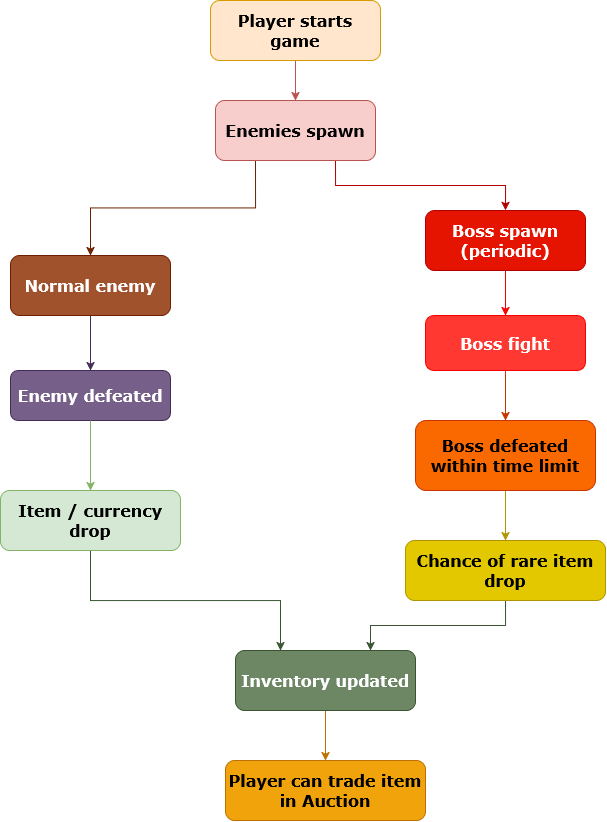

# Squirkle – Frontend Documentation

---

## Application Purpose

Squirkle is a browser-based gaming platform that integrates a Unity WebGL game into a web interface.

Users can:
- defeat enemies
- collect items and coins
- unlock new areas
- trade items through an auction system (auction house)

The goal of the application is to provide an interactive and engaging gameplay experience within a web environment.

---

## Features and Functionality

### Main Features

- **User Management (Authentication)**
  - Google-based login
  - unique username creation

- **Game (Unity WebGL)**
  - continuous enemy spawning
  - different shapes (circle, square, triangle)
  - periodic boss system

- **Inventory System**
  - management of collected items
  - equip / unequip functionality

- **Auction House**
  - listing items
  - purchasing items
  - deleting listings

- **Areas**
  - unlockable using coins

- **Admin Interface**
  - item creation
  - metadata management

### System Flow

During gameplay:
1. Enemies appear
2. The player defeats them
3. Drops include items or currency
4. The inventory is updated
5. Items can be sold through the auction system

#### Gameplay Flow Diagram



---

## Responsiveness

The application is responsive and works properly across different devices.

```
Homepage layout on large screens
```


```
Homepage layout on small screens
```
|  |  |


```
Navigation bar on large screens
```


```
Navigation bar on small screens
```


```
Item details dialog on large screens
```


```
Item details dialog on small screens
```
|  |  |

### Desktop
- full layout
- separate navbar buttons
- wider tables

### Mobile
- hamburger menu (Dropdown)
- smaller UI elements
- usage of ScrollArea
- vertical layout

### Tablet
- intermediate layout

### Technical Solutions
- breakpoint-based rendering (e.g. max-width: 640px)
- height-based optimization (for dialogs)
- usage of Radix UI components

---

## System Architecture

The following diagram shows the overall structure of the application and how different components interact with each other.


---

## Data Handling (Frontend Perspective)

The frontend communicates with the backend through a REST API.

### Managed Data:
- users
- items
- inventory
- listings
- metadata
- areas

### Logical Relationships:
- User → Inventory (1:N)
- Item → Metadata (N:M)
- User → Listings (1:N)

Communication is performed over HTTPS.

---

## Backend Communication

The frontend uses multiple REST API endpoints.

### Examples:

- GET /get-all-items
- GET /get-user-listings/:userId
- GET /get-all-active-listings
- POST /create-listing
- POST /buy-listing/:id
- DELETE /delete-listing/:id

### Error Handling

- usage of HTTP status codes
- toast notifications
- try/catch and .catch() handling

---

## Code

The frontend code:

- is component-based (React)
- uses reusable elements
- is well-structured
- is documented (JSDoc)

### Technologies Used:
- React
- React Router
- Radix UI
- Unity WebGL integration

---

## Testing

### Item Details Dialog Component

An automated test has been created for the `ItemDetailsDialog.jsx` component.

The test verifies:
- item stats are displayed correctly
- the item title, description, and image are rendered properly
- metadata title, description, background color, and text color are displayed correctly
- the equip / unequip button appears correctly in inventory context
- seller, price, and buy button are displayed in buying context
- inactive listings cannot be purchased
- the selected listing price is displayed correctly in create inspection context

The test run was successful: 1 test file and 11 test cases passed.

#### Item Details Dialog Component Test Results


---

## Project Resources

Frontend (deploy):  
https://squirkle2026.netlify.app/

Backend:  
https://github.com/hajos8/Squirkle-backend

Unity game:  
https://github.com/KristoffRed/Squirkle-Unity