# Squirkle – User Manual

---

## Introduction

Squirkle is a browser-based game that integrates a Unity WebGL game engine with a modern web interface.

During gameplay, the user can:
- defeat enemies
- collect items and coins
- unlock new areas
- trade items through the auction system

The purpose of the user interface is to provide simple and intuitive access to the game’s features.

---

## Home Page

When the application is opened, the user arrives on the home page.

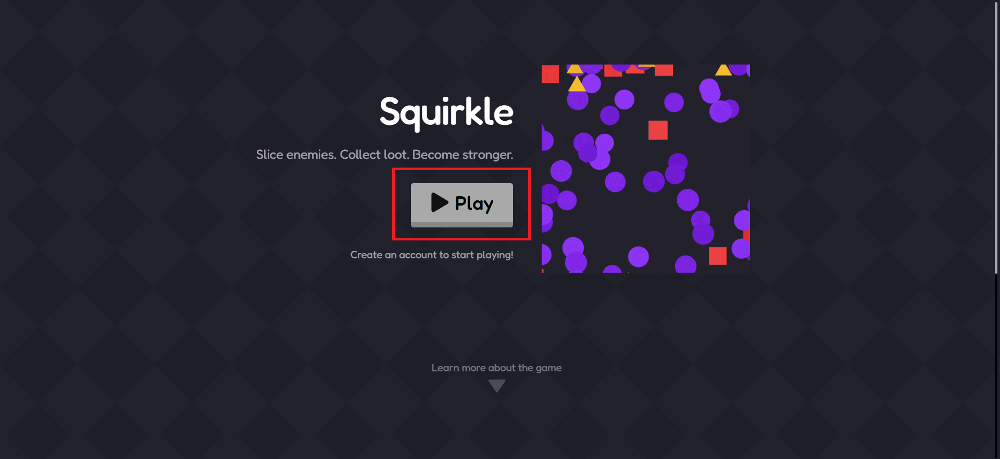

The “Play” button on the home page, marked in red, is used to start the game.

### Functionality

- If the user is **not logged in**, clicking the button redirects them to the **login page**.
- If the user **is logged in**, clicking the button takes them directly to the **game interface**.

This process happens automatically, without requiring any additional action from the user.

### Purpose

The purpose of the home page is to:
- provide quick access to the system
- simplify starting the game

---

## Login

From the home page, the user is redirected to the login interface.

There are two ways to log in:
- with an email address and password
- with a Google account

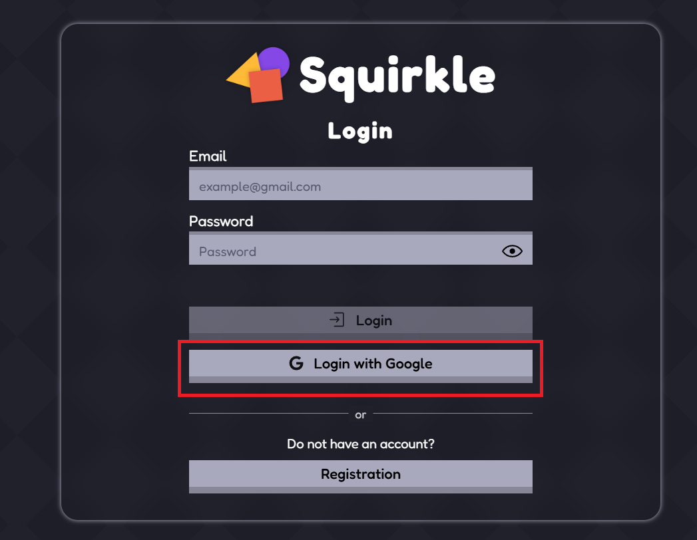

The Google login button, marked in red, allows quick login.

---

### Username Setup

If the user does not have a username yet, the system displays a dialog window.

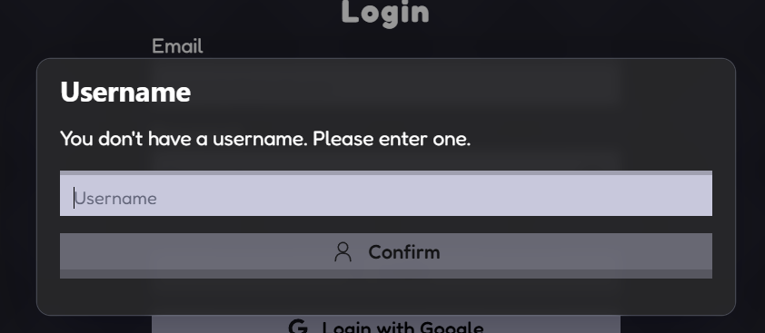

A unique username must be entered here.

---

### Error Handling

If the entered username is already taken, or if an error occurs, the system displays an error message.

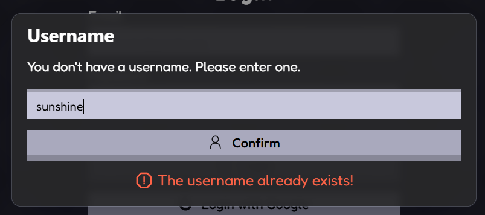

---

### Successful Login

After a successful login and username setup, the system displays a notification and automatically redirects the user to the game interface.

---

## Registration

If the user does not have an account, they can register.

The registration interface can be accessed from the login page using the “Registration” button, marked in red.

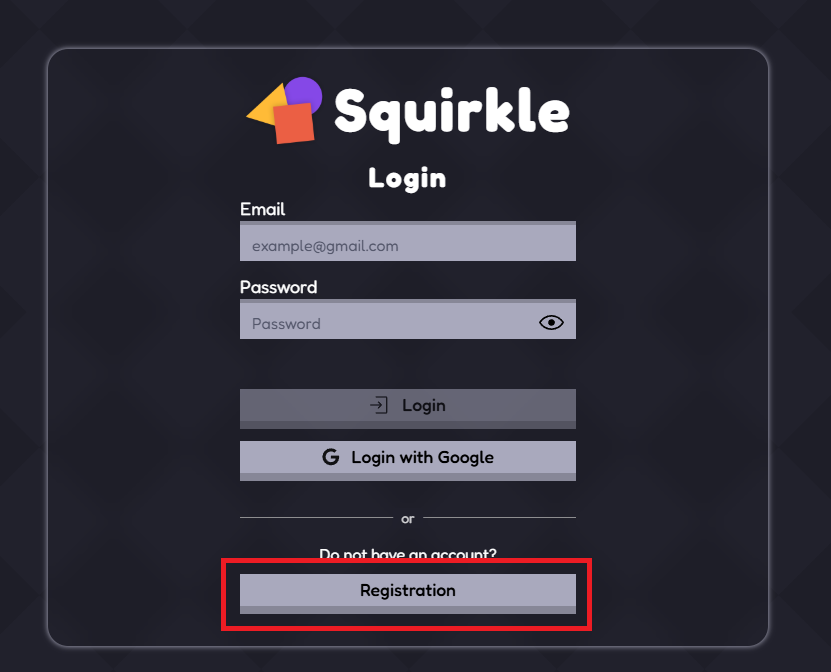

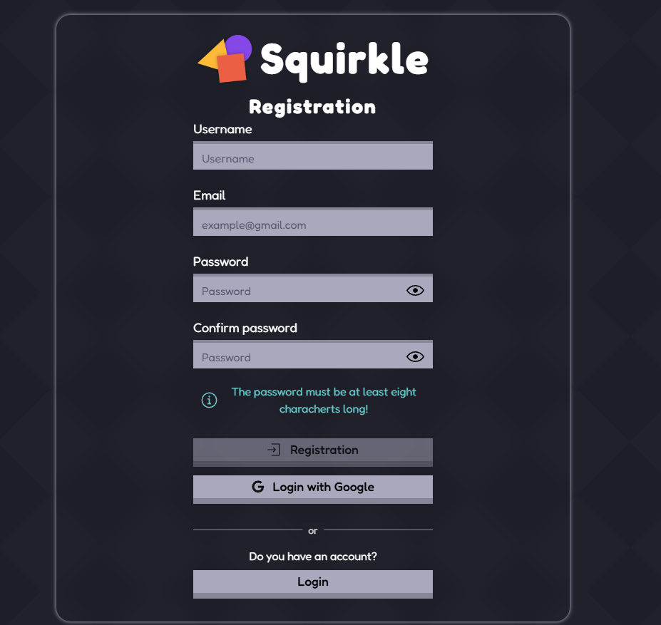

### Required Data

The user must enter the following data:

- username
- email address
- password
- password confirmation

The password must be at least eight (8) characters long.

### Functionality

When the “Registration” button is clicked, the system validates the entered data.

- If the data is valid, the registration is successful
- If an error occurs, the system provides feedback

After successful registration, the user can log in or continue directly to the game.

### Alternative Login

The user can also register and log in with a Google account using the “Login with Google” button.

---

## Game Interface

After logging in, the user is redirected to the game interface.

---

### Navigation Bar

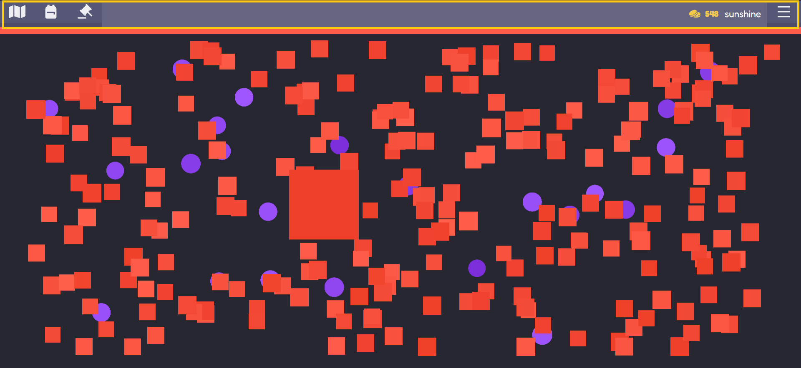

The navigation bar provides access to the main game features.

The top bar contains:
- Area selector
- Inventory
- Auction House
- current coin amount
- username

---

#### Menu in the Top Right Corner

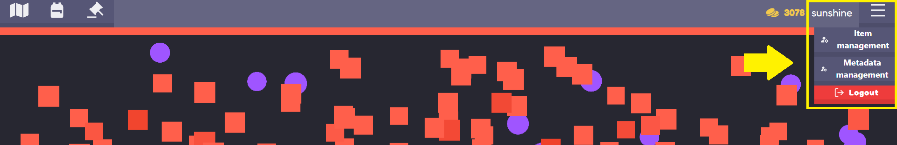

The menu in the top right corner provides additional options.

General function:
- **Logout** – signs the user out of the system

For admin users:
- **Item management** – managing items
- **Metadata management** – managing item metadata

---

#### Mobile View

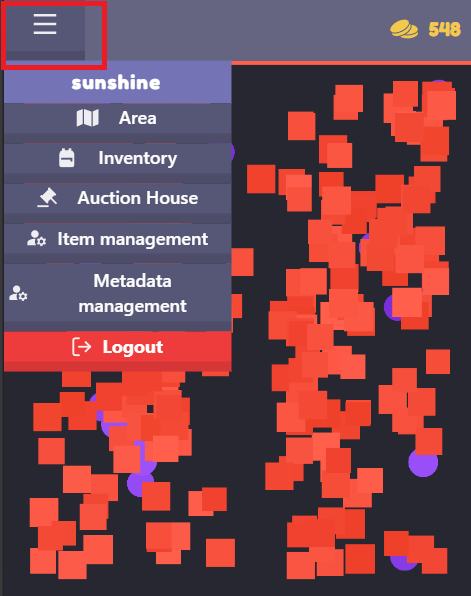

On mobile devices, the navigation bar is simplified:

- menu items are placed inside a hamburger menu
- this helps optimize the available screen space

By opening the menu, the user can access:
- Area
- Inventory
- Auction House
- Admin functions, if available
- Logout

The user’s current coin amount is displayed on the right side.

---

### Gameplay

During gameplay, the user controls the character:

- by moving the mouse on desktop devices
- by touching the screen on mobile devices

The goal is to destroy the different shapes.

After defeating enemies, the user can receive:
- coins
- items, such as weapons and armor

These items can later be managed in the Inventory or sold in the Auction House.

---

### Area Selector

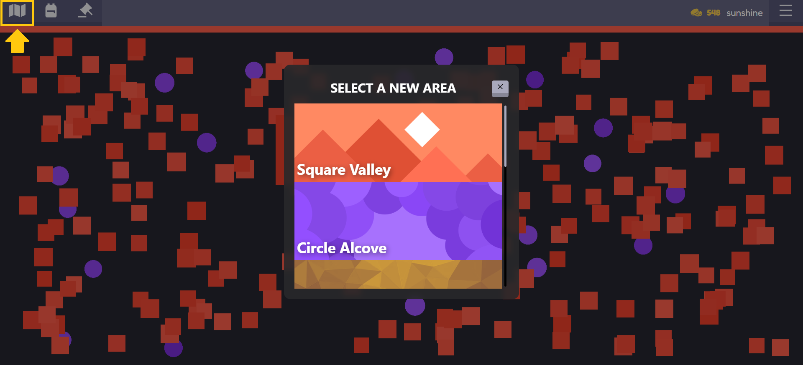

New areas can be selected through the navigation bar.

Unlocking different areas requires coins collected during gameplay.

- if the user has enough coins, the area can be purchased
- otherwise, the system indicates that the user does not have enough coins

Purchased areas can be selected again at any time.

---

## Inventory

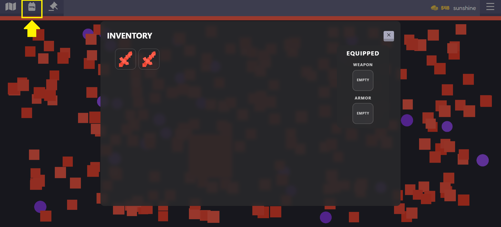

The Inventory is used to manage items collected during gameplay.

By default, it is empty and fills up as the user collects items during the game.

---

### Selecting an Item

The user can click on an item to view its detailed information.

Different item states are displayed visually:
- blue border: listed item
- right-side panel: equipped item

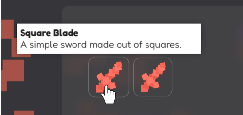

---

### Item Details

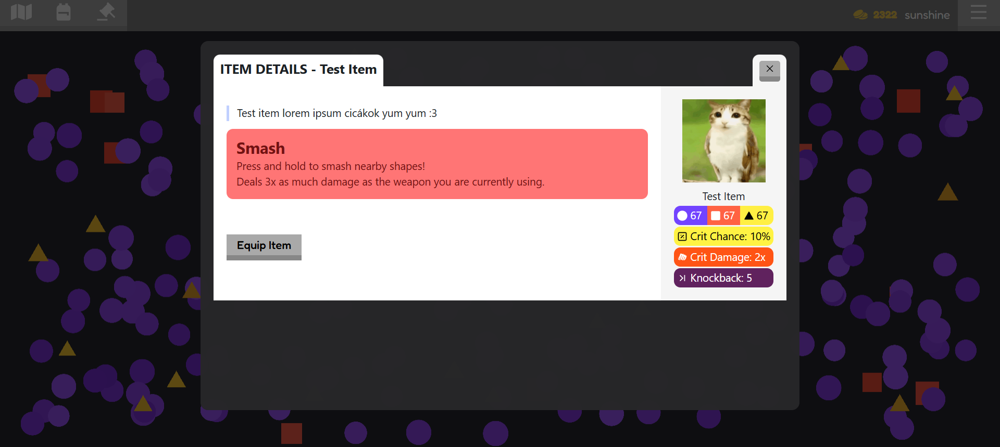

The selected item’s details are displayed in a separate window.

This includes:
- description
- statistics
- special abilities

---

### Equipment

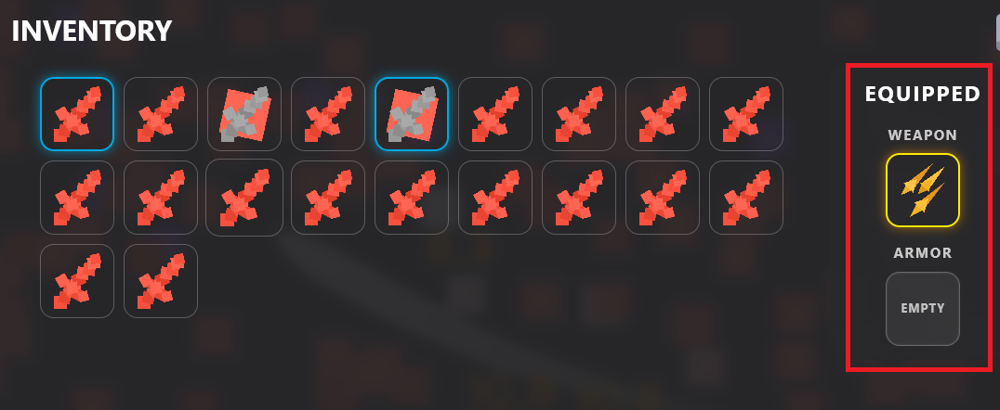

Equipped items are displayed on the right side of the Inventory.

The selected item can be equipped using the “Equip Item” button, and it immediately becomes active during gameplay.

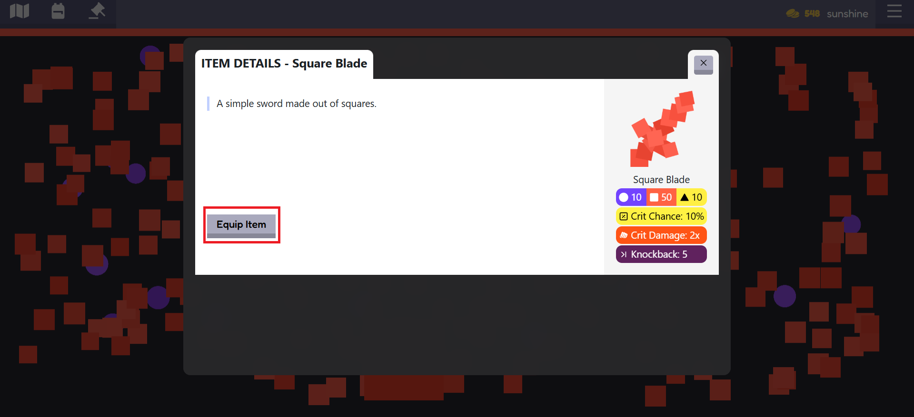

The item can be removed using the “Unequip Item” button.

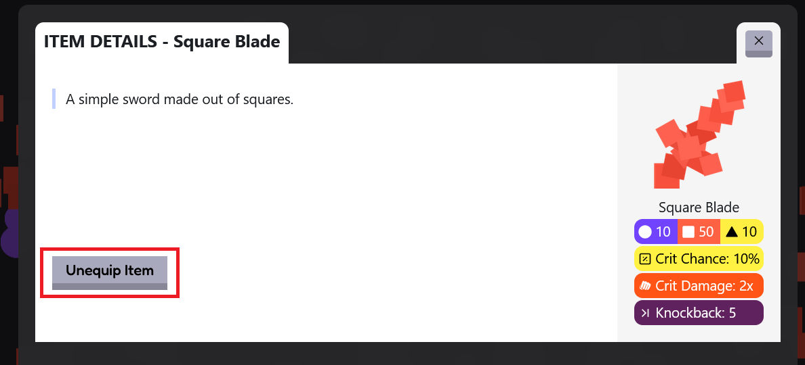

---

### Listed Items

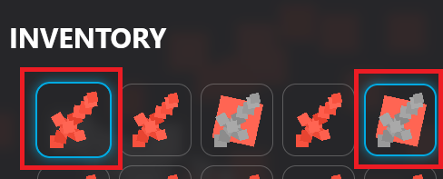

- items listed for sale cannot be used
- items currently in use cannot be listed for sale

---

### Usage / Weapon Activation

Weapon usage depends on the platform:

- **Desktop:**
  - hold the right mouse button for about 1 second
  - after activation, the weapon can be moved

- **Mobile device:**
  - activated by double tapping

---

## Auction House

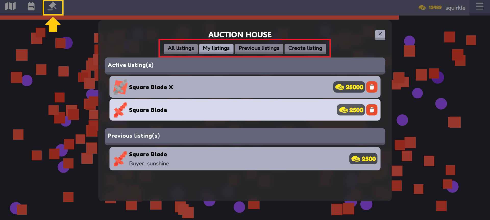

The Auction House allows players to buy and sell items with each other.

### Navigation

- All listings – all active listings
- My listings – the user’s own listings
- Previous listings – previous listings
- Create listing – creating a new listing

---

### Creating a New Listing

The user:
- selects an inventory item
- enters a price
- creates the listing

Important:
- items currently in use cannot be listed

---

### My Listings

The user can manage their own listings here.

Listings can be deleted using the trash icon.

---

### Previous Listings

This section displays previously sold or expired listings.

---

### Item Management

#### Creating a New Item

The admin can create a new item by entering the required data.

The following data can be entered:
- item type
- name and description
- metadata / abilities
- statistics, such as damage, crit chance, knockback, etc.
- image upload

The action can be finalized with the **Submit** button.

#### Modifying an Item

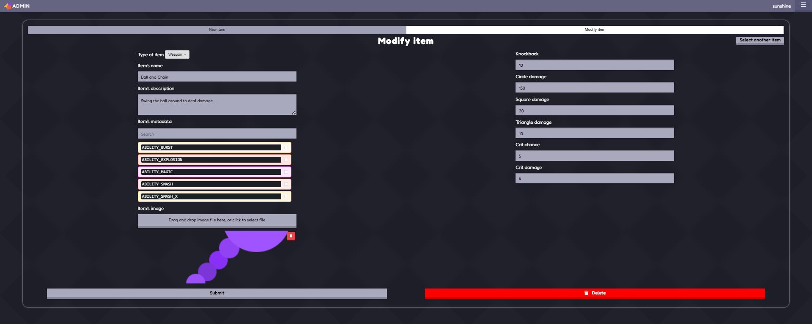

Existing item data can be modified on the Modify item tab.

Available actions:
- editing item data
- deleting an item using the Delete button

Important:
- changes can be saved with the Submit button

#### Selecting an Item

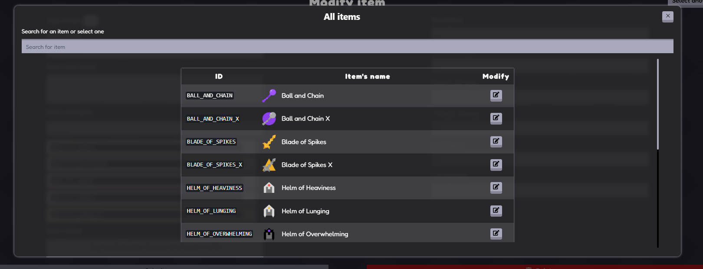

An item must be selected before it can be modified.

This can be done in two ways:
- by browsing the list
- by using search

The selected item’s data appears in the editor interface.

The pencil icon is used to load the selected item’s data.

If the wrong item was selected, a new one can be chosen using the **Select another item** button.

---

### Metadata Management

The admin interface allows creating new metadata elements and modifying existing ones.

Metadata elements define special properties of items, such as abilities and effects.

#### Creating New Metadata

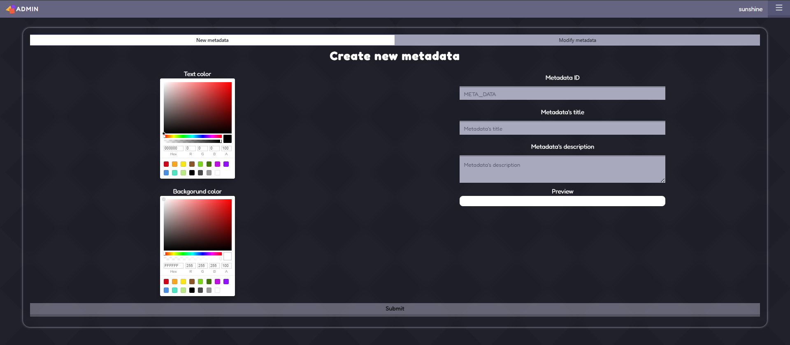

New metadata can be created by entering the required data.

The following data can be entered:
- metadata identifier (ID)
- title
- description
- text color
- background color

The settings are immediately displayed in the Preview section.

The action can be finalized with the **Submit** button.

#### Modifying Metadata

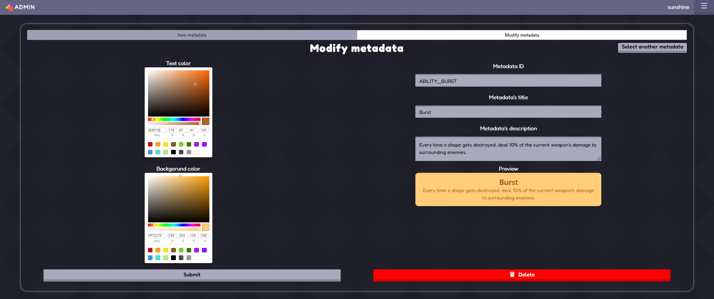

Existing metadata elements can be modified on the Modify metadata tab.

Available actions:
- editing text and description
- changing colors
- viewing an instant preview
- deleting metadata using the Delete button

Changes can be saved with the **Submit** button.

#### Selecting Metadata

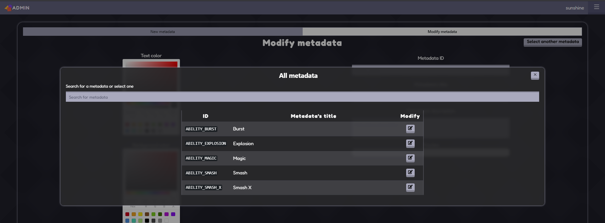

Metadata must be selected before it can be modified.

This can be done:
- by searching
- by selecting it from the list

The pencil icon is used to load the selected metadata data.

If another metadata element is needed, it can be selected using the **Select another metadata** button.

---

## Summary

The Squirkle user interface provides simple and intuitive access to the game’s main features.

The goal of the system is to allow players to navigate quickly and easily between the different functions while keeping the gameplay experience smooth.